# MSM Song Creator
A tool to create all My Singing Monsters songs and timelines from the game files.

## Features
- Create the full songs of all Islands, except of course Composer Island and Colossingum
  - A blacklist and/or whitelist of monsters can be specified. RegEx may be used as well
  - The tempo of the song can be set to anything between 0.5x and 2x. Just like in-game this will change the pitch as well
  - A number of repetitions between 1 and 100 can be specified
- Show the structure/timeline of each song. See the [Screenshots](#screenshots) section for examples
- List all Islands
- List all Monsters

## Help
The help can be shown using the `-h` or `--help` flags. Below is the output of the short version. An output of the long version, i.e. `--help`, can be found [here](help_long.txt).
```
msm 0.1.1
RubixDev
Tool to create all My Singing Monsters songs and timelines from the game files

USAGE:
    msm [FLAGS] [OPTIONS] <island>

FLAGS:
    -h, --help             Prints help information
    -l, --list-islands     Show a list of all valid island numbers and their respective names
    -L, --list-monsters    Show a list of all monsters and their names
    -s, --no-song          Suppress creating song wav file
    -t, --no-timeline      Suppress song timeline
    -V, --version          Prints version information
    -v, --verbose          Logs extra output while processing

OPTIONS:
    -x, --exclude <exclude>...           List of monsters to exclude from the song. RegEx supported
    -X, --exclude-list <exclude-list>    Path to a file with a list of monsters to exclude from the song. Overwrites
                                         names specified by `--exclude`
    -i, --include <include>...           List of monsters to include in the song. RegEx supported
    -I, --include-list <include-list>    Path to a file with a list of monsters to include in the song. Overwrites names
                                         specified by `--include`
    -o, --output <output>                Output folder [default: "./"]
    -p, --path <path>                    Path to MSM data/audio/music [default: "./data/"]
    -r, --repeat <repeat>                How many times the song should be repeated [default: 1]
    -T, --tempo <tempo>                  Set the tempo of the song. Just like in-game this will also change the pitch
                                         [default: 1.0]

ARGS:
    <island>    Island number or name. Required unless `--list-islands` or `--list-monsters` is used
```

## Usage
### Installation
On Windows 10 I strongly recommend to also download 'Windows Terminal' from the Microsoft Store and restart Windows once, for full color and unicode support. On Windows 11 this is pre-installed and on Linux almost every Terminal works.

#### Using pre-built Binaries
Download the latest release for your operating system from the [releases page](https://github.com/RubixDev/msm-song-creator/releases). This is the binary to execute later on.

#### Building from Source
First of all make sure to have Rust and `cargo` installed and working on your system. Then you can download this repository either using [this link](https://github.com/RubixDev/msm-song-creator/archive/refs/heads/master.zip) (equivalent to the green download button at the top) or with
```bash
git clone https://github.com/RubixDev/msm-song-creator.git
```
Once in the downloaded directory run `cargo build --release` in a terminal.
The finished binary can then be found in `target/release/`.

### Global installation on Linux
If you are on Linux you can easily copy the obtained binary to your PATH with
```bash
sudo cp path/to/msm /usr/local/bin/msm
```
You can then just use the `msm` command, regardless which directory you are in.

### Obtaining the Game Files
I cannot provide the game files necessary for this program for legal reasons. I can however show you how to get them from the game yourself.

#### Steam (Recommended)
The Steam version of the game uses uncompressed `.wav` files and thus has higher quality sound files, than the mobile versions, so it is recommended to use these. For these steps I assume you already have Steam installed.

1. Download the game from Steam
2. Open once to make sure all latest sounds are downloaded
3. Open the installation directory. If you are unsure where that is, you can follow these steps:
   1. Open Steam and go to the Library tab
   2. Right click on 'My Singing Monsters'
   3. Click 'Properties'
   4. In the new window click 'Local Files'
   5. Then click 'Browse' and a file explorer should open up in the installation directory
4. Navigate to the subfolder `data/audio/music/`
5. Copy all files in this folder to a location you can easily remember
   1. It is recommended to create a `data` folder next to the downloaded binary and put all files in there

#### Android
The Android version (and likely the other mobile versions as well) use compressed `.ogg` audio files for the monster sounds.

1. Download 'My Singing Monsters' from the PlayStore
2. Open the game at least once to make sure all latest sounds are downloaded
3. Establish some way for file transfer between your phone and computer
   1. It is probably easiest to connect the phone with a USB cable and enable file transfer
4. Copy the file `main.270.com.bigbluebubble.singingmonsters.full.obb` from `Android/obb/com.bigbluebubble.singingmonsters.full/` in your phone's internal storage to your computer.
   1. Don't worry if the file name is not exactly the same. There should only be one file in that folder anyway
5. Extract the contents from that file
   1. Note: on Windows it might be necessary to change the file extension from `.obb` to `.zip`
6. Navigate to the subfolder `assets/audio/music/`
7. Copy all files in this folder to a location you can easily remember
   1. It is recommended to create a `data` folder next to the downloaded binary and put all files in there

### Creating the Songs
1. Open a terminal in the folder with the downloaded program
   1. On Windows this is possible from the File Explorer by right clicking on the folder (or the empty space if already in the folder) and then selecting 'Open in Windows Terminal'. This does only work when 'Windows Terminal' is already installed on your system ([more details](#installation))
   2. On Linux you should already know how to open a terminal
2. Run `./msm 1`
   1. The `1` here is the number of the island, in this case Plant Island. To get a list of all Islands use `./msm -l` or `./msm --list-islands`. Alternatively you can also specify the island name in quotation marks like this: `./msm "Plant Island"`, but make sure you type the name exactly right
   2. When you put the game files somewhere else than a `data` folder next to the program, an error like `File data/world01.mid could not be opened`. In this case specify the path to that folder with the `-p` or `--path` flag manually, e.g. `./msm -p path/to/game/data 1`
   3. The outcome can be further customized with tempo, excluded/included monsters and number of repeats. For this refer to the [help section](#help) or use one of the help commands:
      1. `./msm -h` for short summaries
      2. `./msm --help` for more detailed explanations
3. You should now have a file like `01-Plant_Island.wav` in your directory, which you can open with a music player of your choice

## Troubleshooting
When having any issues, feel free to open a new issue on the [Issues page](https://github.com/RubixDev/msm-song-creator/issues).

## Screenshots
Here are a few screenshots of the song timelines with various settings:

### Full Islands
The command used for all of these looked like
```bash
./msm --no-song n
```
with `n` being every number from 1 to 21 except 11 and 20, because those are Composer Island and the Colossingum.

#### Plant Island
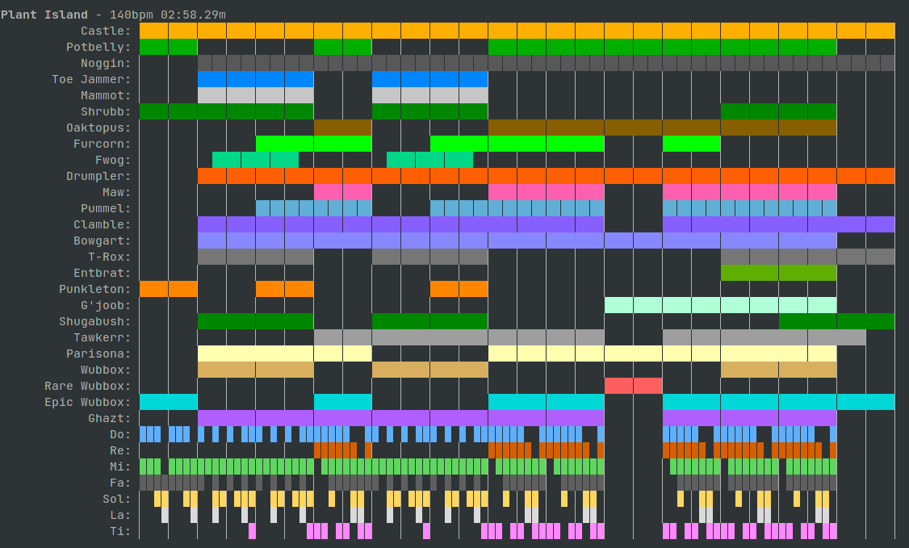
#### Cold Island
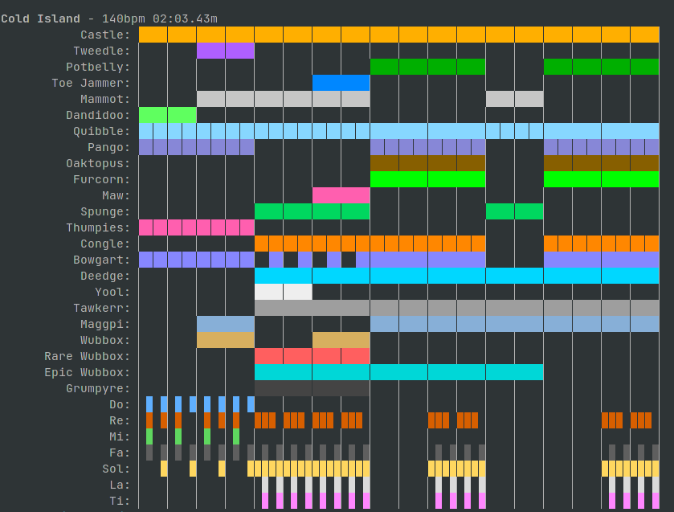
#### Air Island
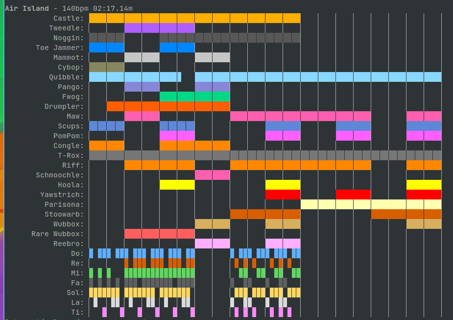
#### Water Island
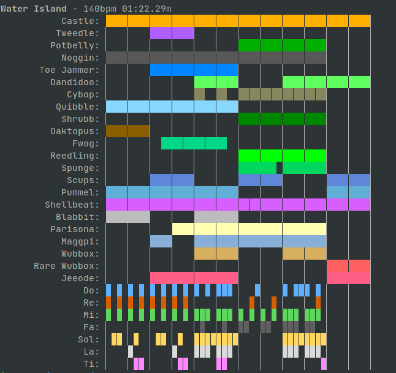
#### Earth Island
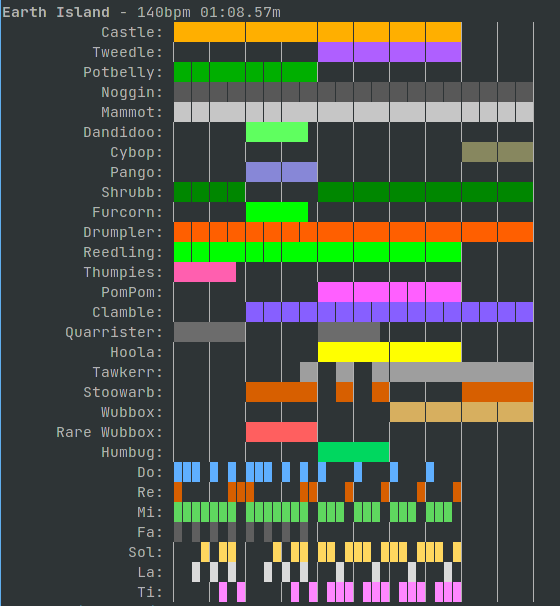
#### Gold Island
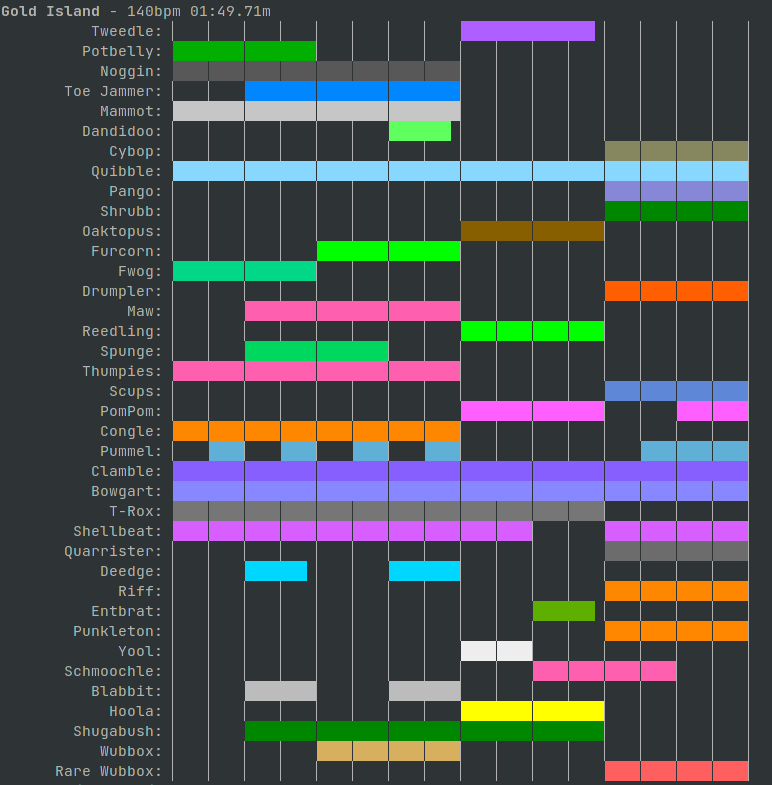
#### Ethereal Island
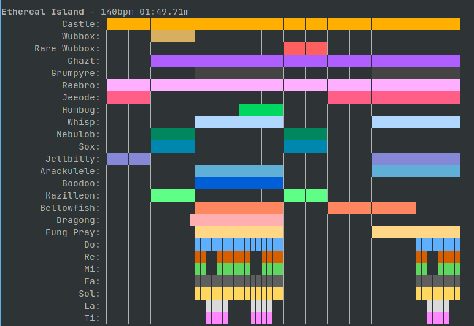
#### Shugabush Island
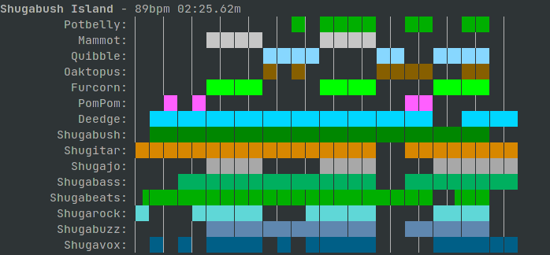
#### Tribal Island
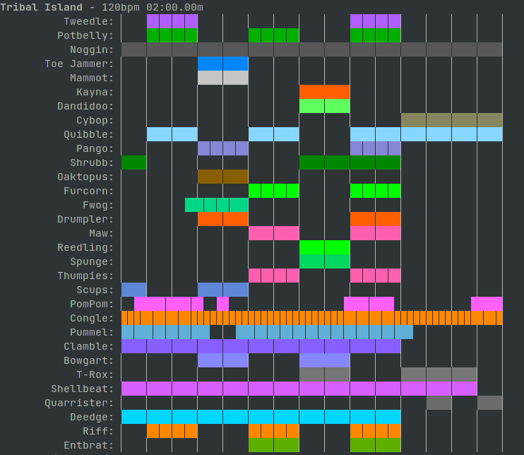
#### Wublin Island
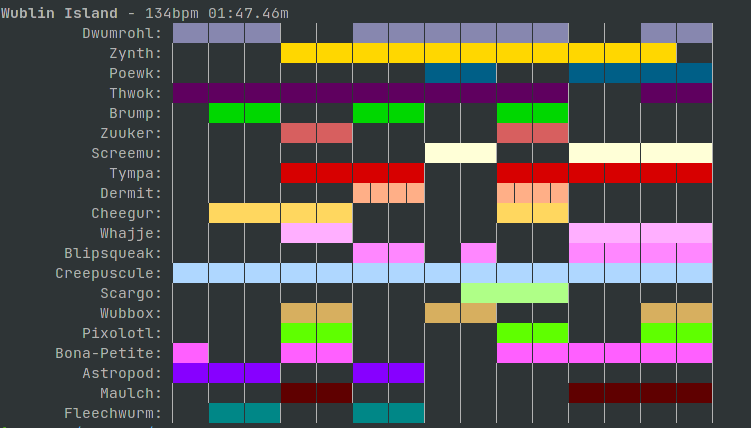
#### Celestial Island
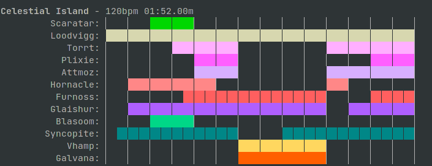
#### Fire Haven
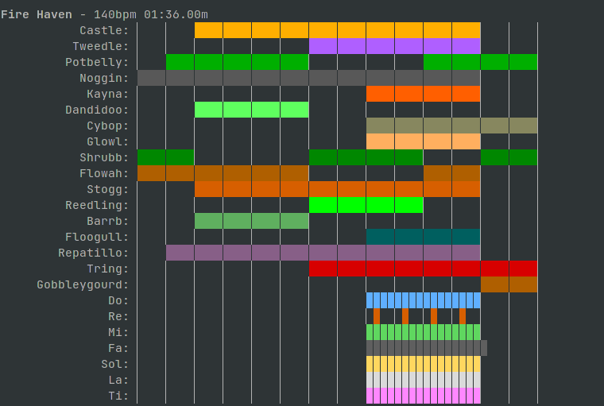
#### Fire Oasis
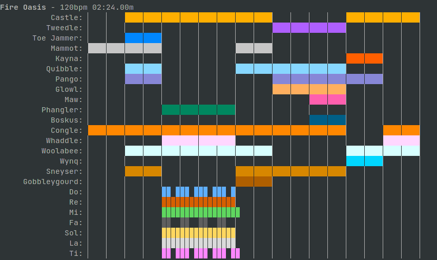
#### Psychic Island
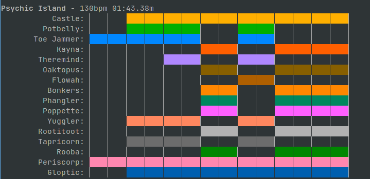
#### Faerie Island
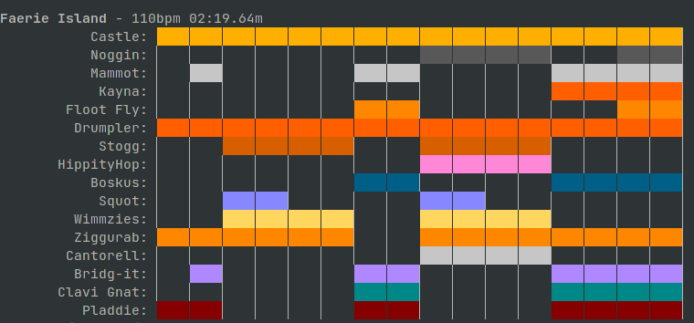
#### Bone Island
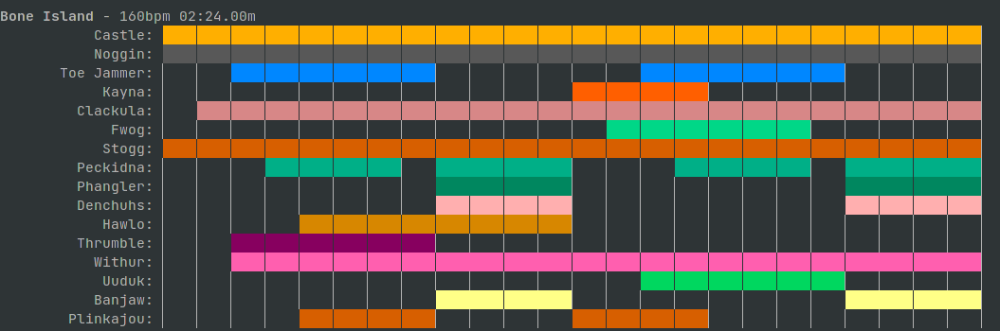
#### Light Island
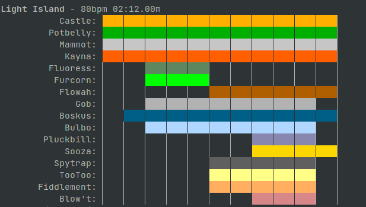
#### Magical Sanctum
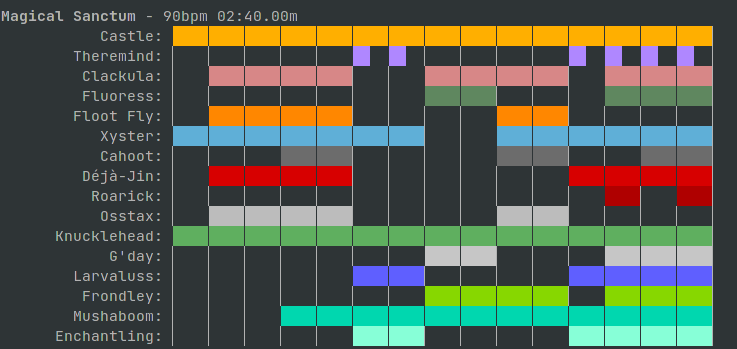
#### Seasonal Shanty
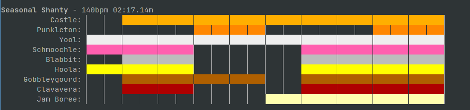

### Cold Island only Dipsters
Command used:
```bash
./msm --no-song -i Do Re Mi Fa Sol La Ti -- 'Cold Island'
```
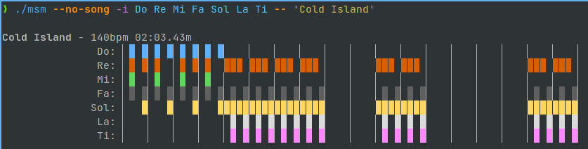

### Earth Island no Natural Monsters
Command used:
```bash
./msm --no-song -i 'Q\d\d_Monster' Wubbox 'Rare Wubbox' Humbug 'VOC_\d\d_Monster' 'S\d\d_Monster' Castle -- 'Earth Island'
```
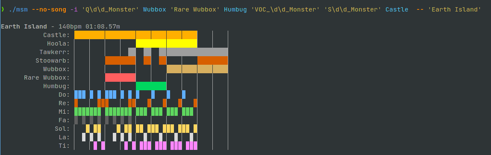

### Wublin Island no Vocal Monsters
Command used:
```bash
./msm --no-song --exclude Brump Maulch Blipsqueak Whajje Dermit Screemu -- 10
```
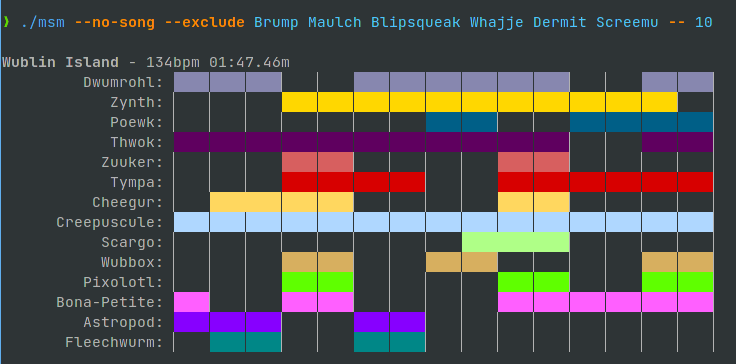
